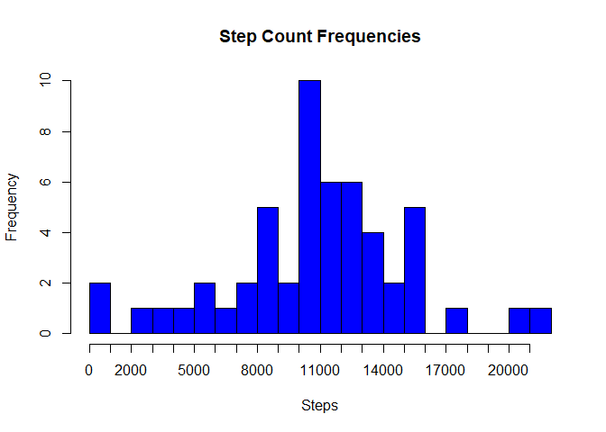
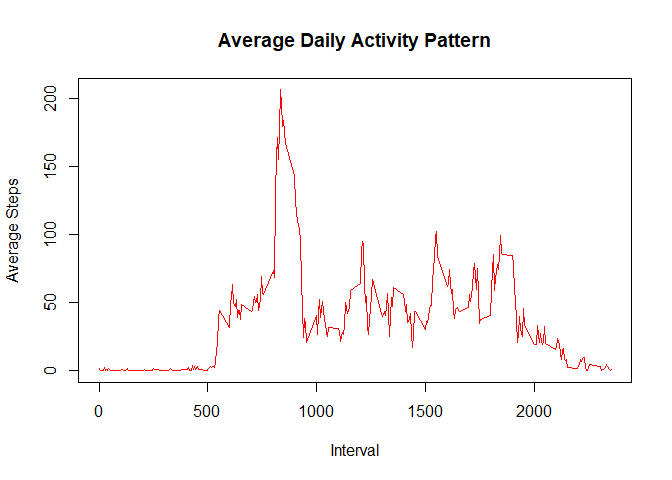
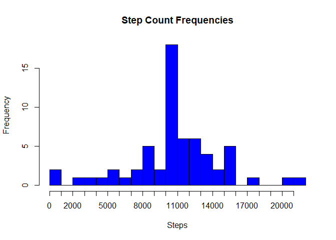
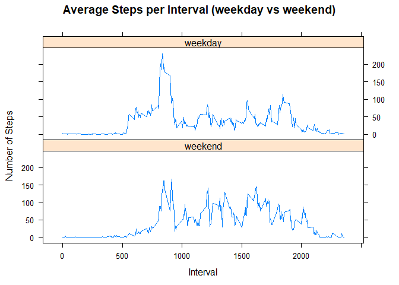

# Reproducible Research: Peer Assessment 1


## Loading and preprocessing the data

```r
knitr::opts_chunk$set(echo = TRUE)
library(dplyr)
library(lattice)
testData <- read.csv("activity.csv")
```


## What is mean total number of steps taken per day?

```r
stepCount <- summarize(group_by(testData, date), StepTotal = sum(steps))
maxSteps <- max(stepCount$StepTotal, na.rm=TRUE)
meanSteps <- mean(stepCount$StepTotal, na.rm=TRUE)
medianSteps <- median(stepCount$StepTotal, na.rm=TRUE)
hist(stepCount$StepTotal,breaks=22, xlab = "Steps", col = "blue", main = "Step Count Frequencies",xaxt='n')
axis(side=1,at=seq(0,maxSteps,1000),labels=seq(0,maxSteps,1000))
```

<!-- -->

The mean number of steps taken each day was 10766.19 and the median number of steps taken was 10765.

## What is the average daily activity pattern?

```r
avgSteps <- summarize(group_by(testData, interval), AvgSteps = mean(steps, na.rm=TRUE))
plot(avgSteps$interval, avgSteps$AvgSteps, type="l", main="Average Daily Activity Pattern", xlab="Interval",ylab="Average Steps", col = "red")
```

<!-- -->


## Inputing missing values

```r
numNA <- nrow(filter(testData,is.na(steps))) + nrow(filter(testData,is.na(date))) + nrow(filter(testData,is.na(interval)))
```

The data set contains 2304 rows with NA values


```r
modifiedData <- testData
modifiedData$steps <- ifelse(is.na(modifiedData$steps),avgSteps$AvgSteps[avgSteps$interval %in% modifiedData$interval], modifiedData$steps)
newStepCount <- summarize(group_by(modifiedData, date), StepTotal = sum(steps))
newMeanSteps <- mean(stepCount$StepTotal, na.rm=TRUE)
newMedianSteps <- median(stepCount$StepTotal, na.rm=TRUE)
hist(newStepCount$StepTotal,breaks=22, xlab = "Steps", col = "blue", main = "Step Count Frequencies",xaxt='n')
axis(side=1,at=seq(0,maxSteps,1000),labels=seq(0,maxSteps,1000))
```

<!-- -->

The mean number of steps taken each day was 10766.19 and the median number of steps taken was 10765. There is not any distinct difference in these values from the earlier analysis. WHile the total number of steps on a given day may be high, there are many time intervals where no steps are taken, which lowers the mean number of steps for that day and also does not drastically affect the total number of steps for that day.

## Are there differences in activity patterns between weekdays and weekends?

```r
modifiedData$date <- as.Date(modifiedData$date)
weekdayList <- c("Monday","Tuesday","Wednesday","Thursday","Friday")
modifiedData$wDay <- factor((weekdays(modifiedData$date) %in% weekdayList),levels=c(FALSE,TRUE), labels=c('weekend','weekday'))
intervalAvg <- summarize(group_by(modifiedData,interval,wDay), AvgSteps = mean(steps, na.rm=TRUE))
xyplot(AvgSteps ~ interval | wDay, data = intervalAvg, type="l", xlab="Interval", ylab="Number of Steps", layout=c(1,2),main="Average Steps per Interval (weekday vs weekend)")
```

<!-- -->

Both graphs begin with low step counts due to the early time of day. The average rises on weekdays earlier than on weekends. This could be because most people work on weekdays and would tend to be moving around more before work. For the rest of a weekday, people are less active due to work/tiredness. Weekends tend to show a more consistent level throughout the day due to people having more time on those days to be active.
